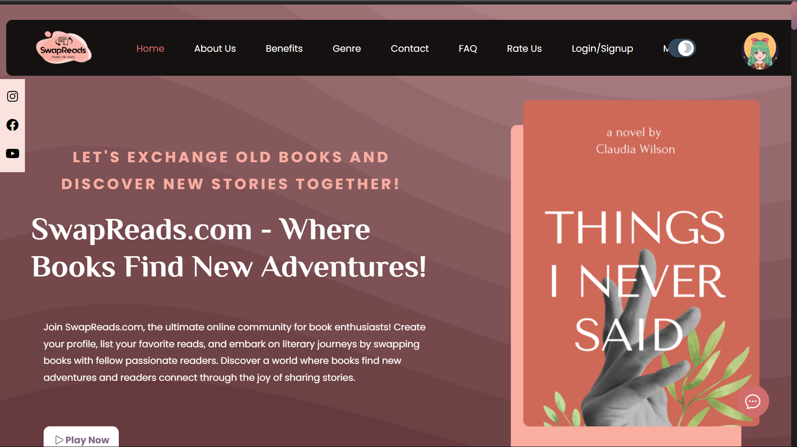
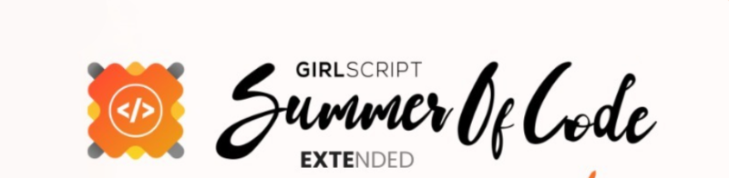
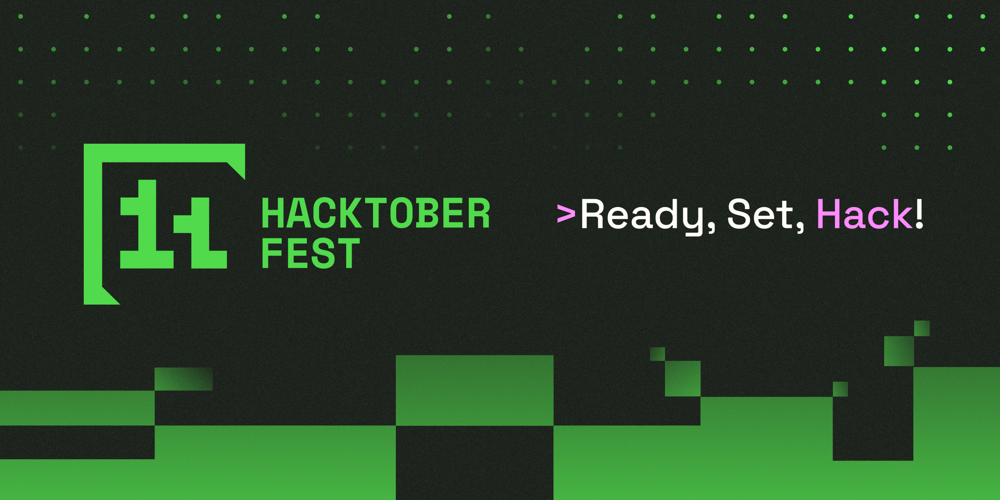

<div align="center">

# SwapReads.com




<i>Connect, Exchange, Explore – Where Book Enthusiasts Swap Books and Discover New Literary Adventures!</i>

</div>

<div align = "center">

[](https://opensource.org/licenses/MIT)

<table align="center">
    <thead align="center">
        <tr border: 1px;>
            <td><b>🌟 Stars</b></td>
            <td><b>🍴 Forks</b></td>
            <td><b>🐛 Issues</b></td>
            <td><b>🔔 Open PRs</b></td>
            <td><b>🔕 Close PRs</b></td>
        </tr>
     </thead>
    <tbody>
         <tr>
            <td></td>
             <td></td>
            <td></td>
            <td></td>
           <td></td>
        </tr>
    </tbody>
</table>
</div>


<hr>

  ### This project is now OFFICIALLY accepted for

## 📋 Participating Programs

| Name                  | Logo                                                      | Purpose                                                                                                      |
|-----------------------|-----------------------------------------------------------|--------------------------------------------------------------------------------------------------------------|
| GSSoC'2024-Extd       |              | The coding period is from October 1st to November 10, during which contributors make contributions and earn points on the platform. |
| Hacktoberfest 2024    |  | Hacktoberfest is a month-long October event welcoming all skill levels to join the open-source community.     |

---

## Project Structure

<!-- START_STRUCTURE -->
```
├── Code_of_Conduct.md
├── DOTENV
├── Information/
│   ├── CODE_OF_CONDUCT.md
│   ├── CONTRIBUTING.md
│   ├── LICENSE
│   ├── Learn.md
│   ├── index.txt
│   └── style-guide.md
├── LICENSE
├── Mystical-fantaies.html
├── README.md
├── SECURITY.md
├── achievements.html
├── activity.css
├── activity.html
├── activity.js
├── address.css
├── address.html
├── assets/
│   ├── GSSoC-Ext.png
│   ├── JSON/
│   │   ├── package-lock.json
│   │   └── package.json
│   ├── css/
│   │   ├── Available.css
│   │   ├── BookRecommend.css
│   │   ├── Error.css
│   │   ├── MenuClick.css
│   │   ├── about.css
│   │   ├── aboutus.css
│   │   ├── addremove.css
│   │   ├── checkout.css
│   │   ├── contributor.css
│   │   ├── event.css
│   │   ├── forgot-pass.css
│   │   ├── freeBooks.css
│   │   ├── litrary_realms.css
│   │   ├── login.css
│   │   ├── playNow.css
│   │   ├── preloader.css
│   │   ├── rate.css
│   │   ├── read_later.css
│   │   ├── readerConn.css
│   │   ├── refresher.css
│   │   ├── socialmedia.css
│   │   ├── style.css
│   │   ├── styles.css
│   │   ├── test-style.css
│   │   ├── tips.css
│   │   └── visitors.css
│   ├── event.css
│   ├── favicon_package_v0.16/
│   │   ├── android-chrome-192x192.png
│   │   ├── android-chrome-256x256.png
│   │   ├── apple-touch-icon.png
│   │   ├── browserconfig.xml
│   │   ├── favicon-16x16.png
│   │   ├── favicon-32x32.png
│   │   ├── favicon.ico
│   │   ├── favicon.svg
│   │   ├── mstile-150x150.png
│   │   ├── safari-pinned-tab.svg
│   │   └── site.webmanifest
│   ├── font-6/
│   │   ├── css/
│   │   │   ├── all.css
│   │   │   ├── all.min.css
│   │   │   ├── brands.css
│   │   │   ├── brands.min.css
│   │   │   ├── fontawesome.css
│   │   │   ├── fontawesome.min.css
│   │   │   ├── regular.css
│   │   │   ├── regular.min.css
│   │   │   ├── solid.css
│   │   │   ├── solid.min.css
│   │   │   ├── svg-with-js.css
│   │   │   ├── svg-with-js.min.css
│   │   │   ├── v4-font-face.css
│   │   │   ├── v4-font-face.min.css
│   │   │   ├── v4-shims.css
│   │   │   ├── v4-shims.min.css
│   │   │   ├── v5-font-face.css
│   │   │   └── v5-font-face.min.css
│   │   └── webfonts/
│   │       ├── fa-brands-400.ttf
│   │       ├── fa-brands-400.woff2
│   │       ├── fa-regular-400.ttf
│   │       ├── fa-regular-400.woff2
│   │       ├── fa-solid-900.ttf
│   │       ├── fa-solid-900.woff2
│   │       ├── fa-v4compatibility.ttf
│   │       └── fa-v4compatibility.woff2
│   ├── free books/
│   │   ├── The-Power-of-Positive-Thinking.pdf
│   │   ├── Time Management (McGraw-Hill).pdf
│   │   └── Web Programming with HTML5, CSS, and JavaScript.pdf
│   ├── hacktoberfest.png
│   ├── html/
│   │   ├── ConnReader.html
│   │   ├── Error.html
│   │   ├── about.html
│   │   ├── addremovebook.html
│   │   ├── adventure.html
│   │   ├── assets/
│   │   │   └── css/
│   │   │       └── event.css
│   │   ├── audio.html
│   │   ├── author.html
│   │   ├── autobiography.html
│   │   ├── biography.html
│   │   ├── blog.html
│   │   ├── book_recommend.html
│   │   ├── booking.html
│   │   ├── booklistswap.html
│   │   ├── bookpref.html
│   │   ├── borrow.html
│   │   ├── checkout.html
│   │   ├── classic.html
│   │   ├── comedy.html
│   │   ├── custom.html
│   │   ├── cyberpunk.html
│   │   ├── detective-fiction.html
│   │   ├── donate.html
│   │   ├── dystopian.html
│   │   ├── event.html
│   │   ├── experimental-fiction.html
│   │   ├── fairytale.html
│   │   ├── fantasy.html
│   │   ├── forgot-pass.html
│   │   ├── freeBooks.html
│   │   ├── god.html
│   │   ├── googlece7a206a6cfbb7ed.html
│   │   ├── historical-fiction.html
│   │   ├── horror.html
│   │   ├── image.png
│   │   ├── img.png
│   │   ├── login.html
│   │   ├── magical-realism.html
│   │   ├── maha.html
│   │   ├── map.html
│   │   ├── midnight.html
│   │   ├── mood.html
│   │   ├── mylogin.html
│   │   ├── mythology.html
│   │   ├── ngo.html
│   │   ├── noir.html
│   │   ├── nonfiction.html
│   │   ├── philosophy.html
│   │   ├── poetry.html
│   │   ├── profileedit.html
│   │   ├── psycological-thriller.html
│   │   ├── quiz.html
│   │   ├── quizzes.html
│   │   ├── ram.html
│   │   ├── rate.html
│   │   ├── read.html
│   │   ├── read_later.html
│   │   ├── romance.html
│   │   ├── satire.html
│   │   ├── school.html
│   │   ├── science-fiction.html
│   │   ├── self-help.html
│   │   ├── social.html
│   │   ├── suspense-thriller.html
│   │   ├── tips.html
│   │   ├── top10.html
│   │   ├── true-crime.html
│   │   └── utopian.html
│   ├── images/
│   │   ├── 1.jpg
│   │   ├── 10-books-30-days.png
│   │   ├── 100.jpg
│   │   ├── 19.jpg
│   │   ├── 1984.jpg
│   │   ├── 20.jpg
│   │   ├── 5.jpeg
│   │   ├── 7.png
│   │   ├── FB icon.png
│   │   ├── LogoPicDark.png
│   │   ├── LogoPicLight.png
│   │   ├── Madame Bovary.webp
│   │   ├── Screenshot 2024-10-28 at 12.09.51 AM
│   │   ├── The Picture of Dorian Gray.jpg
│   │   ├── TheGuide.jpg
│   │   ├── Wings_of_Fire_by_A_P_J_Abdul_Kalam_Book_Cover.jpg
│   │   ├── YT icon.png
│   │   ├── a fine balance.jpg
│   │   ├── achievement-1.jpg
│   │   ├── achievement-2.jpg
│   │   ├── achievement-3.jpg
│   │   ├── achievement-4.jpg
│   │   ├── achievement-5.jpg
│   │   ├── adv.jpg
│   │   ├── aen.jpg
│   │   ├── air.jpeg
│   │   ├── air.jpg
│   │   ├── akira.jpg
│   │   ├── alice.jpg
│   │   ├── alone.jpg
│   │   ├── alt.jpeg
│   │   ├── alter.jpeg
│   │   ├── american.jpg
│   │   ├── anna_karenina.jpg
│   │   ├── ariel.webp
│   │   ├── atomic.jpeg
│   │   ├── author-banner.png
│   │   ├── auto.jpg
│   │   ├── avatar1.jpg
│   │   ├── avatar2.jpg
│   │   ├── avatar3.jpg
│   │   ├── avatar4.jpg
│   │   ├── avatar5.jpg
│   │   ├── award.svg
│   │   ├── bad.jpg
│   │   ├── be.jpeg
│   │   ├── beach.jpg
│   │   ├── bear.jpg
│   │   ├── beauty.jpeg
│   │   ├── become.jpg
│   │   ├── becoming.jpg
│   │   ├── before.jpg
│   │   ├── behind.jpg
│   │   ├── being.jpg
│   │   ├── beingand.jpg
│   │   ├── bel.jpg
│   │   ├── benefits-1.svg
│   │   ├── benefits-2.svg
│   │   ├── benefits-3.svg
│   │   ├── benefits-4.svg
│   │   ├── benefits-5.svg
│   │   ├── benefits-6.svg
│   │   ├── big-sleep.jpg
│   │   ├── big.jpg
│   │   ├── bigs.jpg
│   │   ├── birdbox.jpg
│   │   ├── blind.jpg
│   │   ├── book/
│   │   │   ├── Army.jpg
│   │   │   ├── Economist.jpg
│   │   │   ├── Forbes.jpg
│   │   │   ├── Frontline.jpg
│   │   │   ├── Newsweek.jpg
│   │   │   ├── Philosophy.jpg
│   │   │   ├── Science.jpg
│   │   │   ├── Techlife.jpg
│   │   │   ├── Time_Special.jpg
│   │   │   └── newScience.jpg
│   │   ├── book.png
│   │   ├── bookhover.png
│   │   ├── books_swapRead.jpg
│   │   ├── bookshelf.png
│   │   ├── bookshelfhover.png
│   │   ├── born (1).jpg
│   │   ├── born.jpg
│   │   ├── boss.jpg
│   │   ├── bossy.jpeg
│   │   ├── brave.jpeg
│   │   ├── braven.jpg
│   │   ├── bro.jpg
│   │   ├── brothers_karamazov.jpg
│   │   ├── cabinet.jpg
│   │   ├── call.jpg
│   │   ├── case.jpg
│   │   ├── castle.png
│   │   ├── catch.jpg
│   │   ├── catcher_in_the_rye.jpg
│   │   ├── chain.jpg
│   │   ├── child.jpg
│   │   ├── cind.jpeg
│   │   ├── circe.jpg
│   │   ├── citi.jpg
│   │   ├── city.jpeg
│   │   ├── cl.jpg
│   │   ├── close-white.png
│   │   ├── close.png
│   │   ├── close1.png
│   │   ├── cold.jpg
│   │   ├── colum.jpg
│   │   ├── comedy.jpg
│   │   ├── community.png
│   │   ├── communityhover.png
│   │   ├── confe.jpg
│   │   ├── contact.png
│   │   ├── coraline.jpg
│   │   ├── count.jpg
│   │   ├── couple.jpg
│   │   ├── court.jpg
│   │   ├── crime.jpg
│   │   ├── crime_and_punishment.jpg
│   │   ├── critique.jpg
│   │   ├── ctc1.png
│   │   ├── ctc2.png
│   │   ├── ctc3.png
│   │   ├── ctc4.png
│   │   ├── ctc5.png
│   │   ├── dark.jpg
│   │   ├── darkmode_bg.png
│   │   ├── darkpl.jpg
│   │   ├── devil.jpg
│   │   ├── diary.webp
│   │   ├── dict.jpg
│   │   ├── dispo.jpg
│   │   ├── do.jpg
│   │   ├── dou.jpeg
│   │   ├── dracula.jpeg
│   │   ├── dracula.webp
│   │   ├── dragon.jpg
│   │   ├── dune.jpg
│   │   ├── duno.jpeg
│   │   ├── duno.jpg
│   │   ├── eco.jpg
│   │   ├── edit profile.jpg
│   │   ├── edu.webp
│   │   ├── em.jpeg
│   │   ├── emoji/
│   │   │   ├── emoji-1.png
│   │   │   ├── emoji-2.png
│   │   │   ├── emoji-3.png
│   │   │   ├── emoji-4.png
│   │   │   └── emoji-5.png
│   │   ├── enders.jpg
│   │   ├── epic.jpg
│   │   ├── exorcist.jpg
│   │   ├── exp.jpeg
│   │   ├── eye-close.png
│   │   ├── eye-open.png
│   │   ├── fahrenheit.jpeg
│   │   ├── fantasy.jpg
│   │   ├── farewell.jpg
│   │   ├── fates.jpg
│   │   ├── felon.jpg
│   │   ├── final.png
│   │   ├── fire.jpg
│   │   ├── first-5-read.png
│   │   ├── foundation.jpeg
│   │   ├── frankenstein.jpg
│   │   ├── frog.jpg
│   │   ├── fun.jpg
│   │   ├── game.jpg
│   │   ├── genres/
│   │   │   ├── 1.jpg
│   │   │   ├── 10.jpg
│   │   │   ├── 2.jpg
│   │   │   ├── 3.jpg
│   │   │   ├── 4.jpg
│   │   │   ├── 5.jpeg
│   │   │   ├── 6.jpg
│   │   │   ├── 7.jpg
│   │   │   ├── 8.jpg
│   │   │   ├── 9.jpg
│   │   │   ├── auth1.jpg
│   │   │   ├── auth2.jpg
│   │   │   ├── auth3.jpg
│   │   │   └── c1.jpg
│   │   ├── ggg.jpeg
│   │   ├── ghost.jpg
│   │   ├── girl.jpg
│   │   ├── girlon.jpeg
│   │   ├── girlstop.jpg
│   │   ├── girlwith.jpg
│   │   ├── girlwithd.jpg
│   │   ├── gold.jpg
│   │   ├── gone.jpg
│   │   ├── gonegirl.jpg
│   │   ├── good of small tjings.jpg
│   │   ├── good.jpg
│   │   ├── google button.jpeg
│   │   ├── google icon.jpeg
│   │   ├── goto.jpeg
│   │   ├── gr.jpeg
│   │   ├── gravity.jpg
│   │   ├── great-expectations.jpeg
│   │   ├── great_gatsby.jpg
│   │   ├── grit.jpg
│   │   ├── guest.jpg
│   │   ├── habit.jpg
│   │   ├── hand.jpg
│   │   ├── hang.jpg
│   │   ├── hans.jpg
│   │   ├── hard.jpg
│   │   ├── harry.jpg
│   │   ├── hating.jpg
│   │   ├── haunting.jpeg
│   │   ├── help.png
│   │   ├── helt.jpg
│   │   ├── herland.jpg
│   │   ├── hero-banner.png
│   │   ├── hero-section.avif
│   │   ├── hitch.jpg
│   │   ├── hitcher.jpeg
│   │   ├── hobbit.jpg
│   │   ├── hola.jpg
│   │   ├── home.jpg
│   │   ├── honey.jpg
│   │   ├── horses.jpg
│   │   ├── house.jpg
│   │   ├── houses.jpg
│   │   ├── hss.jpg
│   │   ├── hunger.jpg
│   │   ├── hype.jpeg
│   │   ├── icons8-sun.svg
│   │   ├── images/
│   │   │   ├── b.jpg
│   │   │   ├── bl.jpeg
│   │   │   ├── lib.jpg
│   │   │   ├── n.jpg
│   │   │   ├── nGO.jpg
│   │   │   ├── ngo.jpeg
│   │   │   ├── quiz.jpg
│   │   │   └── school.png
│   │   ├── imm.jpg
│   │   ├── inbox.png
│   │   ├── india after gandhi.jpg
│   │   ├── insta icon.png
│   │   ├── institute.jpg
│   │   ├── island.jpeg
│   │   ├── it.jpeg
│   │   ├── itends.jpg
│   │   ├── ja.jpeg
│   │   ├── jack.jpg
│   │   ├── jane_eyre.jpg
│   │   ├── jk.jpeg
│   │   ├── jo.jpeg
│   │   ├── journey.jpg
│   │   ├── kafta.jpg
│   │   ├── kill.jpg
│   │   ├── king.jpg
│   │   ├── kiss.jpg
│   │   ├── la.jpg
│   │   ├── leaves.jpg
│   │   ├── left.jpeg
│   │   ├── les.jpg
│   │   ├── liad.jpg
│   │   ├── lies.jpeg
│   │   ├── light.jpg
│   │   ├── like.jpg
│   │   ├── lock.jpg
│   │   ├── logo_darkbg.png
│   │   ├── logo_whitebg.png
│   │   ├── logout.png
│   │   ├── lonely.jpeg
│   │   ├── long.jpg
│   │   ├── look.jpg
│   │   ├── love.jpg
│   │   ├── ma.jpg
│   │   ├── maha.jpg
│   │   ├── malala.jpg
│   │   ├── malto.webp
│   │   ├── mar.jpg
│   │   ├── martian.jpeg
│   │   ├── mebeforeyou.jpg
│   │   ├── mee.jpg
│   │   ├── mermaid.jpg
│   │   ├── metra.jpg
│   │   ├── mg.jpeg
│   │   ├── mid.jpg
│   │   ├── midnight children.jpg
│   │   ├── midnight.jpg
│   │   ├── milk.jpg
│   │   ├── mind.jpeg
│   │   ├── mindset.jpg
│   │   ├── mise.jpeg
│   │   ├── mist.jpg
│   │   ├── mlt.jpg
│   │   ├── moby.jpg
│   │   ├── mobydick.jpg
│   │   ├── modern.jpg
│   │   ├── mona.jpeg
│   │   ├── moon.png
│   │   ├── moon_solid.svg
│   │   ├── murder.jpg
│   │   ├── my.jpg
│   │   ├── mystery.jpg
│   │   ├── naked.jpg
│   │   ├── name.jpg
│   │   ├── narnia.jpg
│   │   ├── ne.jpeg
│   │   ├── nelson.jpeg
│   │   ├── nes.jpeg
│   │   ├── neuro.jpeg
│   │   ├── neuroman.jpg
│   │   ├── never.jpg
│   │   ├── new_logo.png
│   │   ├── new_logo_banner_dark.png
│   │   ├── new_logo_banner_light.png
│   │   ├── new_logo_dark.png
│   │   ├── nick.jpg
│   │   ├── night.jpg
│   │   ├── nightingale.jpg
│   │   ├── norse.jpg
│   │   ├── notebook.jpeg
│   │   ├── now.jpg
│   │   ├── nyt.jpg
│   │   ├── obj.jpeg
│   │   ├── ocean.jpg
│   │   ├── odd.jpg
│   │   ├── odyssey.jpg
│   │   ├── oryx.jpeg
│   │   ├── oryx.jpg
│   │   ├── out.jpg
│   │   ├── outlander.jpg
│   │   ├── part-of-our-community.png
│   │   ├── patient.jpeg
│   │   ├── ped.jpg
│   │   ├── petsematory.jpeg
│   │   ├── philopsphy.jpg
│   │   ├── pic1.jpeg
│   │   ├── pic2.jpeg
│   │   ├── pic3.jpeg
│   │   ├── pic4.jpeg
│   │   ├── postman.jpg
│   │   ├── power.jpeg
│   │   ├── preview-1.png
│   │   ├── preview-2.png
│   │   ├── preview-3.png
│   │   ├── preview-4.png
│   │   ├── preview-5.png
│   │   ├── pride.jpg
│   │   ├── priory.jpg
│   │   ├── pross.jpeg
│   │   ├── ramayana.jpeg
│   │   ├── rapun.jpg
│   │   ├── re.jpg
│   │   ├── read.png
│   │   ├── readhover.png
│   │   ├── ready.jpeg
│   │   ├── red.jpg
│   │   ├── redh.jpg
│   │   ├── republic.jpeg
│   │   ├── road.jpg
│   │   ├── robin.jpg
│   │   ├── rom.jpg
│   │   ├── rosie.jpg
│   │   ├── rumi.webp
│   │   ├── rums.jpg
│   │   ├── sap.jpg
│   │   ├── scarlet.jpg
│   │   ├── sch.jpg
│   │   ├── sci.jpg
│   │   ├── science.jpg
│   │   ├── settings.png
│   │   ├── shantaram.jpg
│   │   ├── share-books.png
│   │   ├── sher.jpg
│   │   ├── shining.jpg
│   │   ├── shutter.jpg
│   │   ├── shutteris.jpeg
│   │   ├── side.jpg
│   │   ├── silence.jpg
│   │   ├── silent.jpg
│   │   ├── silentp.jpg
│   │   ├── sim.jpg
│   │   ├── sings.jpeg
│   │   ├── snow.jpeg
│   │   ├── snowcrash.jpg
│   │   ├── snowq.jpg
│   │   ├── snowwh.jpeg
│   │   ├── spirit.jpg
│   │   ├── sss.jpeg
│   │   ├── steve.jpg
│   │   ├── stevejobs.jpeg
│   │   ├── str.jpg
│   │   ├── subtle.jpg
│   │   ├── sun.png
│   │   ├── sunf.jpg
│   │   ├── swap-read-mega-1.png
│   │   ├── tatoo.jpg
│   │   ├── tele.png
│   │   ├── telephone.png
│   │   ├── testimonials-1.jpg
│   │   ├── testimonials-2.jpg
│   │   ├── testimonials-3.jpg
│   │   ├── testimonials-4.jpg
│   │   ├── testimonials-5.jpg
│   │   ├── testimonials-6.jpg
│   │   ├── the inheritance of book.jpg
│   │   ├── thief.jpg
│   │   ├── think.jpg
│   │   ├── three.jpg
│   │   ├── thriller.jpg
│   │   ├── thus.jpeg
│   │   ├── to_kill_a_mockingbird.png
│   │   ├── train to paki.jpg
│   │   ├── tree.avif
│   │   ├── trendingbook1.jpg
│   │   ├── trendingbook2.jpg
│   │   ├── trendingbook3.jpg
│   │   ├── trendingbook4.jpg
│   │   ├── trendingbook5.jpg
│   │   ├── true crime.jpg
│   │   ├── twitter-icon.png
│   │   ├── twitter.png
│   │   ├── un.jpg
│   │   ├── uprooted.jpg
│   │   ├── user.jpg
│   │   ├── utopia.jpeg
│   │   ├── v.jpg
│   │   ├── wald.jpg
│   │   ├── war.jpeg
│   │   ├── website-login.png
│   │   ├── website-ss.png
│   │   ├── wheel.jpg
│   │   ├── white tiger.jpg
│   │   ├── wife.jpg
│   │   ├── wild.jpg
│   │   ├── win.jpg
│   │   ├── wind.jpeg
│   │   ├── winter.jpg
│   │   ├── woman.jpg
│   │   ├── wood.jpg
│   │   ├── wuthering_heights.jpg
│   │   ├── wwz.jpg
│   │   ├── yes.jpg
│   │   ├── young.jpeg
│   │   └── your-first-read.png
│   ├── js/
│   │   ├── ReaderConn.js
│   │   ├── addremove.js
│   │   ├── checkout.js
│   │   ├── comsp.js
│   │   ├── contribute.js
│   │   ├── downloadPDF.js
│   │   ├── faq.js
│   │   ├── fire.js
│   │   ├── forgotPassword.js
│   │   ├── freeBooks.js
│   │   ├── loadmore.js
│   │   ├── login.js
│   │   ├── menuButton.js
│   │   ├── preloader.js
│   │   ├── rate.js
│   │   ├── rateUsModal.js
│   │   ├── read_later.js
│   │   ├── refresher.js
│   │   ├── script.js
│   │   ├── scroll-reveal.js
│   │   ├── scroll.js
│   │   ├── signinGoogle.js
│   │   ├── signup.js
│   │   ├── subscribe.js
│   │   ├── swiper-bundle.min.js
│   │   ├── test-script.js
│   │   └── visitors.js
│   ├── package-lock.json
│   ├── svg/
│   │   └── refresher.svg
│   └── validation/
│       ├── validate.schema.js
│       └── zodschema.js
├── audio/
│   ├── AtTwilight.mp3
│   ├── Bernice Bobs Her Hair by F. Scott Fitzgerald _ Audiobooks Youtube Free _ Short Stories Youtube [ ezmp3.cc ].mp3
│   ├── ChristmasSingVillage.mp3
│   ├── HomelyHeroine.mp3
│   ├── StoryTeller.mp3
│   ├── The Landlady - Roald Dahl [ ezmp3.cc ].mp3
│   ├── The Lottery Ticket by Anton Chekhov Audiobook [ ezmp3.cc ].mp3
│   ├── The Magic Shop by H. G. Wells Audiobook - FULL [ ezmp3.cc ] (1).mp3
│   ├── at-twilight.jpg
│   ├── au1.mp3
│   ├── bernier bobs her hair.jpg
│   ├── christmas-sing-in-our-village.jpg
│   ├── landlady.jpg
│   ├── lotery ticket.jpeg
│   ├── the-homely-heroine.jpg
│   ├── the-magic-shop-17 (1).jpg
│   └── the-story-teller-1.jpg
├── audiobook.html
├── bank.jpg
├── biographies.html
├── book.jpg
├── books.html
├── chatt.css
├── chatt.html
├── chatt.js
├── cod.jpg
├── comsp.html
├── connectWithsame.html
├── contactus1.html
├── contributing.txt
├── contributor/
│   ├── contributorss.css
│   ├── contributorss.html
│   └── contributorss.js
├── controller/
│   ├── Rating.js
│   ├── book.js
│   └── subscribe.js
├── cookiepolicy.html
├── cookies.html
├── copyrightpolicy.html
├── costefficient.html
├── darkmode1.html
├── diverseLiteracy.html
├── e.css
├── e.html
├── e.js
├── email.css
├── email.html
├── environmental-impact.html
├── exchangeHub.css
├── footer1.css
├── footer1.html
├── gulpfile.js
├── help.html
├── historical-chronicals.html
├── icon-192x192.png
├── icon-512x512.png
├── index.html
├── intriguing-mysteries.html
├── jsFileEntries.js
├── lib.jpg
├── logout.css
├── logout.js
├── lol.html
├── manifest.json
├── map.jpg
├── mindful-living.html
├── modals(privacy policy).css
├── models/
│   ├── BookDonation.js
│   ├── Rating.js
│   └── book.js
├── mylogin.html
├── n.jpg
├── our-vision.html
├── package-lock.json
├── package.json
├── payment.css
├── payment.html
├── payment.jpg
├── payment.js
├── personalized-reading.html
├── playNow.html
├── popup.jpg
├── popup.js
├── pricing.html
├── privacynotice.html
├── profiletest.html
├── refundpolicy.html
├── repo_structure.txt
├── revitalize.html
├── romantic-esc.html
├── routes/
│   └── books.js
├── sc.jpg
├── scifi.html
├── script.js
├── scripts.js
├── scrollbar.css
├── scrollbar.js
├── sense-sensibility_01_austen_64kb.mp3
├── server.js
├── signup1.html
├── sitemap.html
├── stackbit.config.ts
├── stay_connect.css
├── subscribe.html
├── sw.js
├── terms&cond.html
├── testp.css
├── testp.js
├── thrilling-adventures.html
├── translate.html
├── up-arrow (1).png
├── upi.jpg
├── vanilla-tilt.js
├── vedio.mp4
├── webpack.config.js
├── wishlist.css
├── wishlist.html
└── wishlist.js
```
<!-- END_STRUCTURE -->

<hr>

## 📚 Table of Contents
- 📖 [Introduction](#-introduction)
- 📰 [Featured In](#-featured-in)
- ❓ [The Problem](#-the-problem)
- 💡 [How SwapReads.com Solves These Problems](#-how-swapreadscom-solves-these-problems)
- 💻 [Tech Stacks](#-tech-stacks)
- 🤝 [Contribution](#-contribution)
- 🌍 [Open Innovation Challenge](#-open-innovation-challenge)
- 📞 [Contact Us](#-contact-us)
- 📜 [Code of Conduct](#-code-of-conduct)
- 💙 [Support Our Project](#-support-our-project)
- ⚙️ [Project Setup](#-project-setup)
- 🎉 [Contributors](#-contributors)
- 🌐 [Website Preview](#-website-preview)
- ⭐ [Stargazers](#-stargazers)
- 🍴 [Forkers](#-forkers)


SwapReads.com is the solution to common challenges faced by book enthusiasts in today's digital age. We've identified key problems and developed a platform that addresses them efficiently and effectively.

<hr>

## <h2> Introduction<h2>

[SwapReads](https://swapreadsconnect.netlify.app/#) is a vibrant online platform dedicated to connecting book lovers from around the world. Our mission is to make reading more accessible, affordable, and sustainable by enabling readers to exchange books and discover new literary adventures.

In today’s fast-paced world, we understand the challenges faced by book enthusiasts—ranging from limited access to diverse books, high costs, to the environmental impact of book production. At SwapReads.com, we address these concerns by creating a community where members can swap their books, exchange personalized recommendations, and engage in meaningful discussions with fellow readers.

We believe in fostering a global community of readers who are passionate about sharing knowledge, expanding their literary horizons, and reducing waste through book exchanges. SwapReads.com promotes sustainable reading habits while creating a trusted, social environment for book lovers to connect and thrive.

Join us today and explore a world where books are exchanged, friendships are formed, and new adventures are just a swap away!

## <h2> Featured In</h2>

<table>

   <tr>
      <th>Event Logo</th>
      <th>Event Name</th>
      <th>Event Description</th>
   </tr>
   <tr>
      <td></td>
      <td>GirlScript Summer of Code 2024</td>
      <td>GirlScript Summer of Code is a three-month-long Open Source Program conducted every summer by GirlScript Foundation. It is an initiative to bring more beginners to Open-Source Software Development.</td>
   </tr>
   <tr>
      <td></td>
      <td>Hacktoberfest 2024</td>
      <td>Hacktoberfest is a month-long celebration of open source software run by DigitalOcean, GitHub, and Twilio. It encourages contributions to open source projects and promotes a global community of developers.</td>
      </tr>

</table>

<hr>

## <h2> The Problem</h2>

1. **Limited Book Access:**
   - Many readers struggle to find a variety of books locally.

2. **Book Expenses and Sustainability:**
   - Buying new books is expensive, and the environmental impact of book production is a concern.

3. **Lack of Personalized Recommendations:**
   - Generic book recommendations from algorithms lack a personal touch.

4. **Social Isolation in Reading:**
   - Reading has become a solitary activity, with readers missing out on sharing thoughts and discoveries.

5. **Unused Book Collections:**
   - Readers often have books that are read and then set aside, collecting dust.

## <h2> How SwapReads.com Solves These Problems</h2>

1. **Global Book Exchange:**
   - SwapReads.com connects users globally, allowing them to exchange books regardless of location.

2. **Cost-Effective and Sustainable Reading:**
   - By swapping books, users reduce expenses and contribute to a more sustainable reading culture.

3. **Personalized Recommendations and Community Trust:**
   - Users share favorite reads, providing and receiving personalized recommendations from a trusted community.

4. **Social Connection and Book Discussions:**
   - Features like private messaging and community forums foster a social environment for book discussions.

5. **Revitalizing Unused Book Collections:**
   - SwapReads.com encourages users to share and exchange books that are sitting idle on their shelves.
  
<hr>

## <h2> Tech Stacks</h2>


<hr>

## <h2> Contribution</h2>

Contributions are what make the open-source community such an amazing place to learn, inspire, and create. Any contributions you make are **greatly appreciated**.

- If you have any suggestions for the project, such as reporting a bug, improving the UI, or enhancing the README.md file, feel free to **open an issue** to discuss it or directly create a pull request with the necessary changes.
- Please make sure to check your spelling and grammar.
- Create individual pull requests for each suggestion to keep changes focused and manageable.

Your involvement helps to improve the project and make it better for everyone. Thank you for your contributions!

Kindly go through [CONTRIBUTING.md](contributing.txt) to understand everything from setup to contributing guidelines.

If you would like to contribute to the project, please follow our contribution guidelines.

<hr>

## <h2> Open Innovation Challenge</h2>

SwapReads.com actively participates in the Open Innovation Challenge by cultivating a global community of readers. Our platform champions open access to a wide range of books, promotes sustainable reading habits through book swapping, and harnesses user-generated content to offer personalized recommendations. With community-driven discussions and data-driven optimizations, SwapReads.com is committed to advancing the goals of inclusivity, sustainability, and collaborative innovation in the world of literature.

Join SwapReads.com today and embark on a literary journey like never before!


## <h2> Contact Us</h2>

<table>
    <tr>
        <th>Role</th>
        <th>LinkedIn</th>
        <th>Discord</th>
        <th>Email</th>
    </tr>
    <tr>
        <td>Project Admin</td>
        <td><a href="https://www.linkedin.com/in/anurag-verma-b91417253/" target="_blank">LinkedIn</a></td>
        <td><a href="https://discordapp.com/users/anuragverma_108" target="_blank" class="discord">Discord</a></td>
        <td>anuragvermacontact@gmail.com</td>
    </tr>
    <tr>
        <td>Mentor</td>
        <td><a href="https://www.linkedin.com/in/huamanraj/" target="_blank">LinkedIn</a></td>
        <td><a href="https://discordapp.com/users/amanraj" target="_blank" class="discord">Discord</a></td>
        <td>amanraj12.ar@gmail.com</td>
    </tr>
    <tr>
        <td>Mentor</td>
        <td><a href="https://www.linkedin.com/in/riti-chandak-315392215/" target="_blank">LinkedIn</a></td>
        <td><a href="https://discordapp.com/users/riti1641" target="_blank" class="discord">Discord</a></td>
        <td>ritichandak@gmail.com</td>
    </tr>
    <tr>
        <td>Mentor</td>
        <td><a href="https://www.linkedin.com/in/rishabhdhawad/" target="_blank">LinkedIn</a></td>
        <td><a href="https://discordapp.com/users/rishabhdhawad" target="_blank" class="discord">Discord</a></td>
        <td>rishabhdhawad29@gmail.com</td>
    </tr>
      <tr>
        <td>Mentor</td>
        <td><a href="https://www.linkedin.com/in/avantika-sankhe-844a6b278/" target="_blank">LinkedIn</a></td>
        <td><a href="https://discordapp.com/users/whatsavadoin" target="_blank" class="discord">Discord</a></td>
        <td>avantikasankhe1@gmail.com</td>
    </tr>
</table>

<hr>

<!-- Code of conduct -->

## <h2> Code of Conduct</h2>

We are committed to fostering a welcoming and inclusive environment for everyone. All contributors and participants are expected to uphold the following values:

- Be respectful of different viewpoints and experiences.
- Show empathy toward others.
- Use inclusive language.

Please read and follow our [Code of Conduct](Code_of_Conduct.md) to foster an inclusive community.
If anyone violates these standards, they may be banned from the community.

<hr>

## <h2> Support Our Project</h2>

If you find this project helpful, please consider giving it a star on GitHub! Your support helps to grow the project and reach more contributors.

<hr>

## <h2> Project Setup</h2>

This section guides you through setting up the project on your local machine. Follow these steps to get started:

**Prerequisites:**

* **Operating System:** [Compatible operating systems, e.g., Windows 10+, macOS 11+, Ubuntu 18.04+]
* **Node.js and npm (or yarn):**  Node.js and npm (or yarn) are essential for managing project dependencies.
```bash
https://nodejs.org/en/download/package-manager
```

or 

```bash 
https://docs.npmjs.com/downloading-and-installing-node-js-and-npm
```
**Steps:**
1. **Fork the Repository:**

      a. Visit the Repository:
      
       
       
      b. Locate the "Fork" button, usually located in the top-right corner of the repository page, and click it. <br> 
      c. Choose a Destination: Select the repository's destination, which is typically your personal GitHub account. <br> 
      d. Create the Fork: Click the "Create fork" button to create a copy of the repository under your account.
      


2. **Create a folder for this project and open it on your vscode editor**

3. **Clone the Repository:**

    * Open your terminal or command prompt and navigate to your desired project directory.
    * After that, open your forked repository and click on this **code** button and copy the HTTPS link
   
    

    * Now write the below command and paste your HTTPS link in vscode terminal 
     ```bash
     git clone 
     ```
    * Now you have successfully cloned the repository


3. **Navigate to the Project Directory:**
   ```bash
   cd .\SwapReads\  
   ```

4. **Install Dependencies:**
   ```bash
    npm install  # Or yarn install, if using yarn
   ```

## <h2> Contributors</h2>
<div align='center'>
   <h3>Thank you for contributing to our repository</h3>

   [](https://contrib.rocks/image?repo=anuragverma108/SwapReads)

</div>

## <h2> Website Preview</h2>

https://github.com/user-attachments/assets/f430e59e-d744-4b60-9884-b7eb4643ba72


🌐 **Visit our website:** [SwapReads](https://swapreadsconnect.netlify.app/#)

## <h2> Stargazers</h2>

<div align='center'>

[](https://github.com/anuragverma108/SwapReads/stargazers)

</div>

## <h2> Forkers</h2>
<div align='center'>

[](https://github.com/anuragverma108/SwapReads/network/members)

</div>

<div align="center">
    <a href="#top">
        
    </a>
</div>

### Show some ❤️ by starring this awesome repository!
